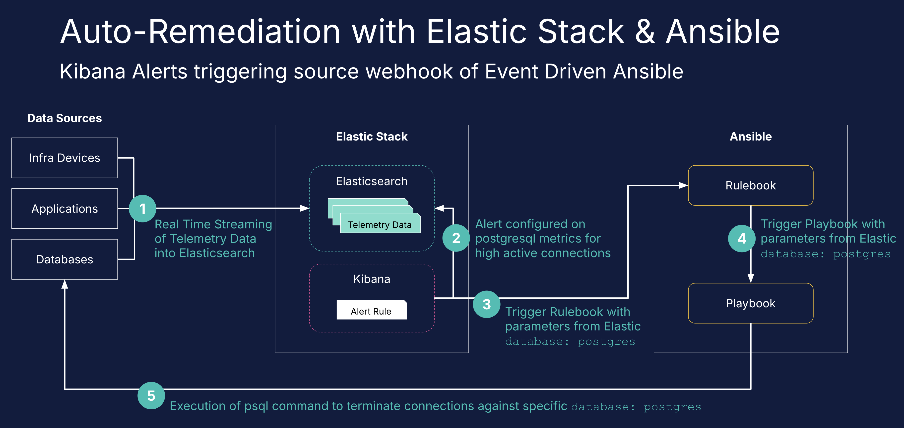
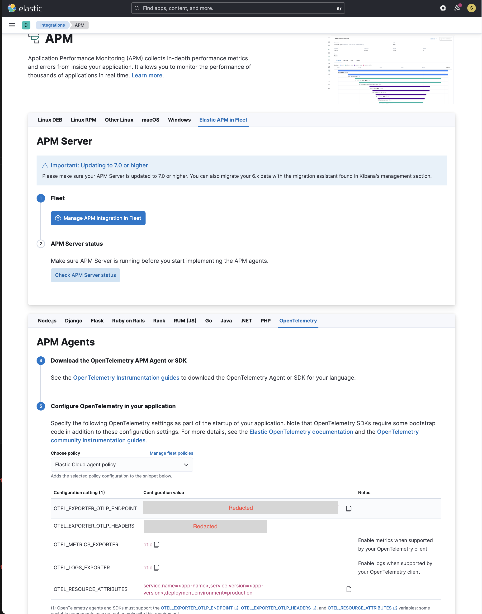
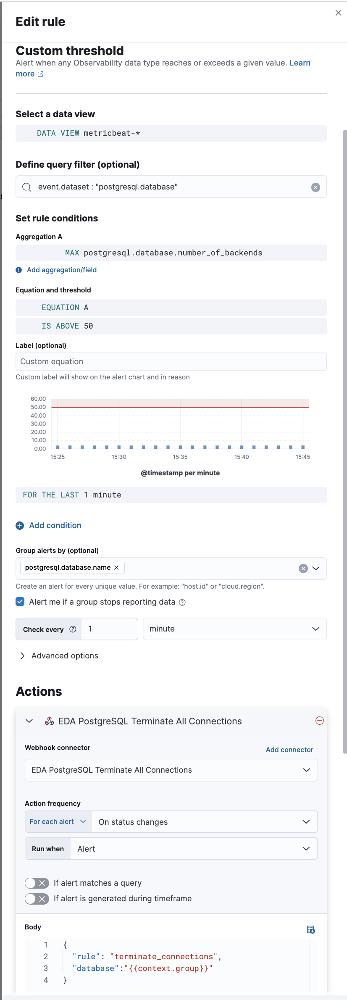
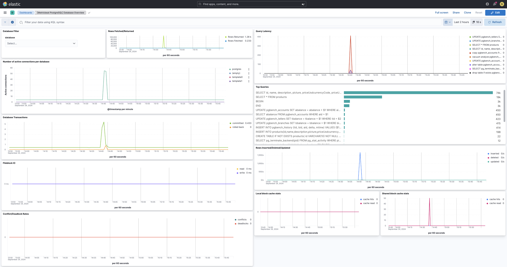
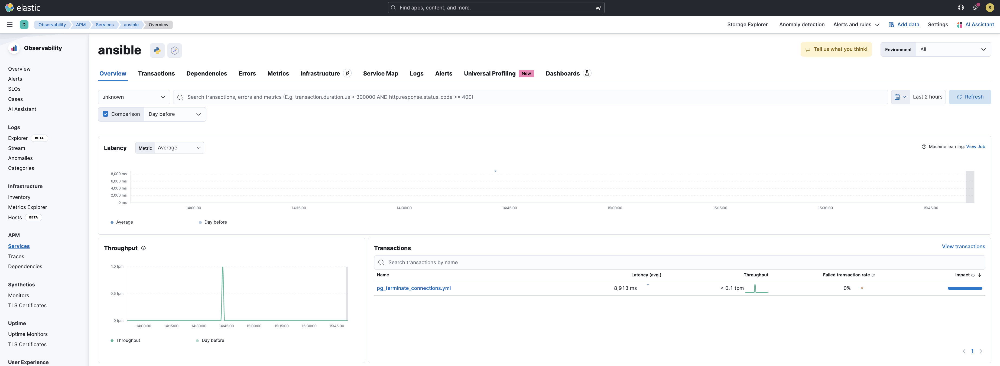
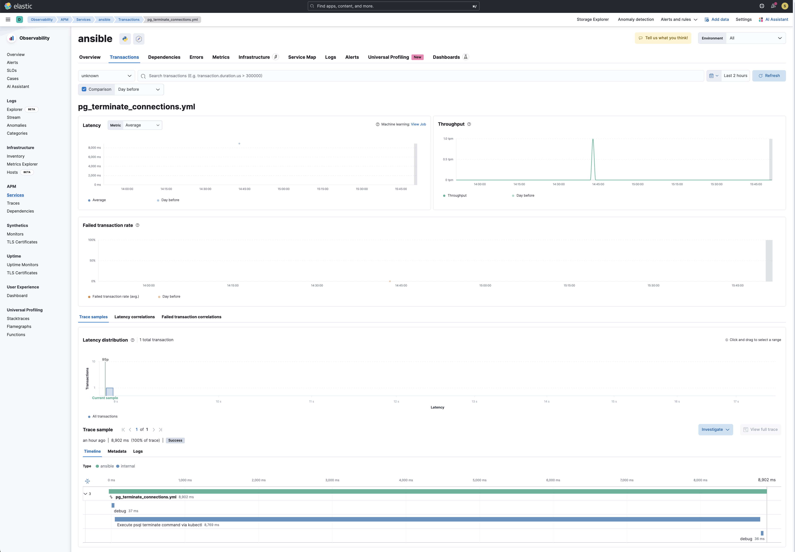
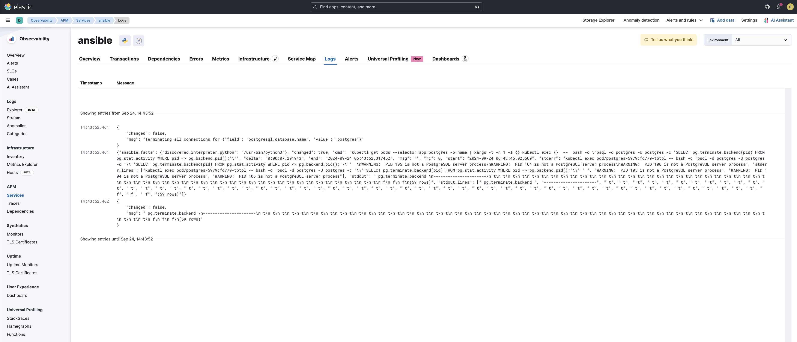

Sample project on using elastic stack as a source for event driven ansible, with CICD Observability configured for ansible back to elastic stack.



# Pre-requisites
1. ESS Deployment with Integration Server

    a. postgresql metrics are streaming into the deployment
2. Server with ansible and ansible rulebook installed, requires python 3.9 and above

    a. this server should also have access to kubernetes cluster and have kubectl cli installed

## Configure environment variables on ansible server for OTEL
Replace `<Elastic Cloud APM Endpoint>` and `<Authorization Token>` with values from your ESS Deployment.

The values can be referenced from `Elastic Integration > APM > APM Agents > OpenTelemetry`.

```
export OTEL_EXPORTER_OTLP_ENDPOINT=<Elastic Cloud APM Endpoint>
export OTEL_EXPORTER_OTLP_HEADERS="<Authorization Token>"
export OTEL_SERVICE_NAME=ansible
export ANSIBLE_OPENTELEMETRY_ENABLED=true
export OTEL_RESOURCE_ATTRIBUTES=service.name=ansible,service.version=1.0,deployment.environment=production
```

ansible.cfg needs to have `callbacks_enabled = community.general.opentelemetry` as well.



## Import Kibana alert & connector
The Kibana Connector is a webhook to connect to ansible rulebook which uses webhook as a source and listens on port 8081.

The Kibana Alert is configured to query from `metricbeat-*` index where `postgresql.database.number_of_backends` is greater than 50.



# Simulating high active connections on postgresql

Execute the following command to trigger pgbench in postgresql pod container
```
kubectl get pods --selector=app=postgres -o=name | xargs -t -n 1 -I {} kubectl exec {}  --  bash -c "PGPASSWORD='redacted' pgbench -i -h localhost -p 5432 -U postgres postgres && PGPASSWORD='redacted' pgbench -h localhost -p 5432 -U postgres -j 1 -c 50 -T 300 postgres"
```

You should see a spike in active connections. Kibana rule will be triggered after a while and execute action to trigger ansible rulebook.


# CICD Observability
Navigate to APM to view traces and logs collected for the execution of the ansible playbook.





